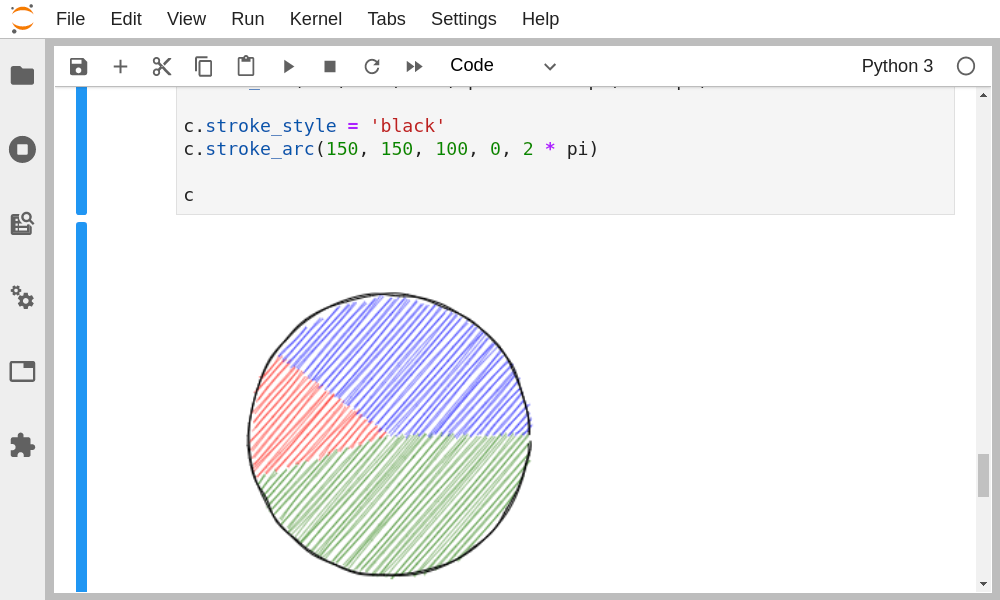
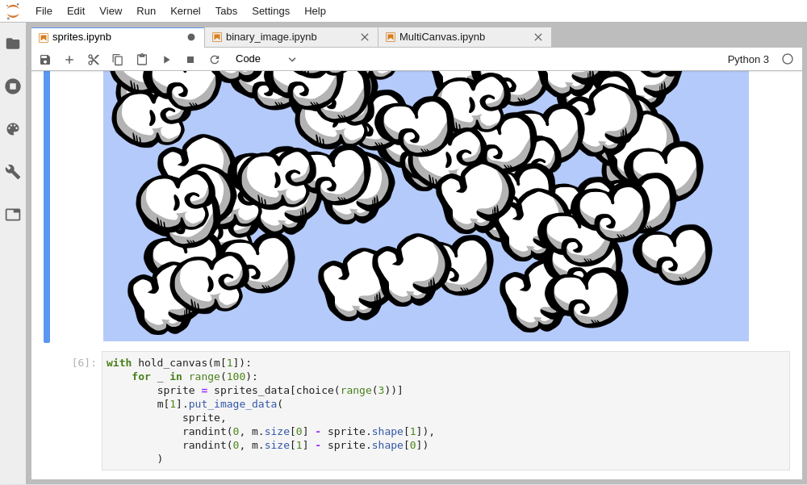
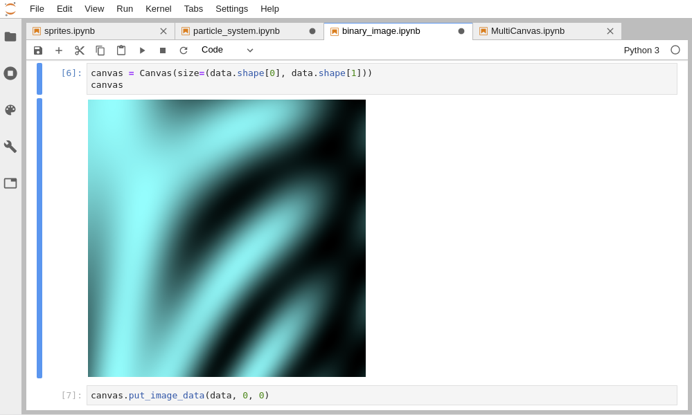

<p align="center"></p>
<h1 align="center">ipycanvas</h1>
<h2 align="center"> Interactive Canvas in Jupyter </h1>

[](https://ipycanvas.readthedocs.io/en/latest/?badge=latest)
[](https://mybinder.org/v2/gh/martinRenou/ipycanvas/stable?urlpath=lab%2Ftree%2Fexamples)
[](https://ipycanvas.readthedocs.io/en/latest/lite/lab)
[](https://pepy.tech/project/ipycanvas)
[](https://gitter.im/martinRenou/ipycanvas?utm_source=badge&utm_medium=badge&utm_campaign=pr-badge&utm_content=badge)

ipycanvas is a lightweight, fast and stable library exposing the [browser's Canvas API](https://developer.mozilla.org/en-US/docs/Web/API/Canvas_API) to IPython.
It allows you to draw simple primitives directly from Python like text, lines, polygons, arcs, images etc. This simple toolset allows you to draw literally anything!

## Try it online!

You can try it online by clicking on this badge:

[](https://mybinder.org/v2/gh/martinRenou/ipycanvas/stable?urlpath=lab%2Ftree%2Fexamples)

## Documentation

You can read the documentation following this link: https://ipycanvas.readthedocs.io

## Questions?

If you have any question, or if you want to share what you do with ipycanvas, [start a new discussion on Github](https://github.com/martinRenou/ipycanvas/discussions/new)!

Or join the gitter channel: [](https://gitter.im/martinRenou/ipycanvas?utm_source=badge&utm_medium=badge&utm_campaign=pr-badge&utm_content=badge)

## Installation

You can install using `pip`:

```bash
pip install ipycanvas orjson
```

Or using `conda`:

```bash
conda install -c conda-forge ipycanvas
```

And if you use jupyterlab <= 2:

```bash
conda install -c conda-forge yarn
jupyter labextension install @jupyter-widgets/jupyterlab-manager ipycanvas
```

A development installation guide, can be found [here](https://ipycanvas.readthedocs.io/en/latest/installation.html#development-installation)

## Examples

### Create John Conway's Game Of Life


### Give a "hand-drawn" style to your drawings using the RoughCanvas



### Draw Particles from IPython


### Custom Sprites



### Draw data directly from a NumPy array



### Create your own plotting library **fully** in Python


