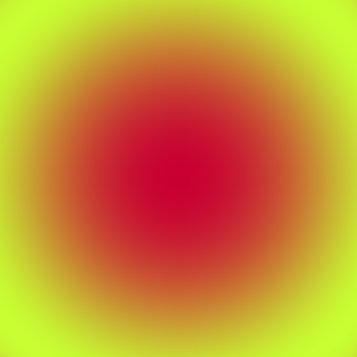

Drawing images
==============

From an Image widget
--------------------

Coming soon!

From another Canvas
-------------------

Coming soon!

From a NumPy array
------------------

You can directly draw a NumPy array of pixels on the ``Canvas``, it must be a 3-D array of integers and the last dimension must be 3 or 4 (rgb or rgba), with values going from ``0`` to ``225``.

- ``put_image_data(image_data, dx, dy)``: Draw an image on the Canvas. ``image_data`` should be  a NumPy array containing the image to draw and ``dx`` and ``dy`` the pixel position where to draw (top left pixel of the image).

.. code:: python

    import numpy as np

    from ipycanvas import Canvas

    x = np.linspace(-1, 1, 600)
    y = np.linspace(-1, 1, 600)

    x_grid, y_grid = np.meshgrid(x, y)

    blue_channel = np.array(np.sin(x_grid**2 + y_grid**2) * 255, dtype=np.int32)
    red_channel = np.zeros_like(blue_channel) + 200
    green_channel = np.zeros_like(blue_channel) + 50

    image_data = np.stack((red_channel, blue_channel, green_channel), axis=2)

    canvas = Canvas(size=(image_data.shape[0], image_data.shape[1]))
    canvas.put_image_data(image_data, 0, 0)

    canvas

