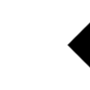
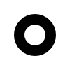

Drawing paths
=============

There are two ways for creating and drawing a path in ipycanvas.

Using Path2D
------------

You can define a Path2D given an SVG path. Note that once the path is created, it is read only, you cannot dynamically change the path value.
Using the Path2D class is very useful and efficient when you want to reuse the same path multiple times.

See https://developer.mozilla.org/en-US/docs/Web/SVG/Tutorial/Paths for documentation about SVG paths.

- ``Path2D(value)``: Creates a Path2D given the SVG path string value.

.. code:: Python

    from ipycanvas import Canvas, Path2D

    canvas = Canvas(width=350, height=350)

    path1 = Path2D('M80 80 A 45 45, 0, 0, 0, 125 125 L 125 80 Z')
    path2 = Path2D('M230 80 A 45 45, 0, 1, 0, 275 125 L 275 80 Z')
    path3 = Path2D('M80 230 A 45 45, 0, 0, 1, 125 275 L 125 230 Z')
    path4 = Path2D('M230 230 A 45 45, 0, 1, 1, 275 275 L 275 230 Z')

    canvas.fill_style = 'green'
    canvas.fill(path1)

    canvas.fill_style = 'purple'
    canvas.fill(path2)

    canvas.fill_style = 'red'
    canvas.fill(path3)

    canvas.fill_style = 'blue'
    canvas.fill(path4)

    canvas

.. image:: images/path2d.png

Using Path commands
-------------------

A path is a list of points, connected by segments of lines that can be of different shapes, curved or not,
of different width and of different color. A path can be closed. To make shapes using paths, we take some
extra steps:

- First, you create the path with ``begin_path``
- Then you use drawing commands to add shapes into the path
- Once the path has been created, you can ``stroke`` or ``fill`` the path to render it

Here are the functions used to perform these steps:

- ``begin_path()``: Creates a new path. Once created, future drawing commands are directed into the path and used to build the path up.
- Path commands like ``line_to`` and ``arc``
- ``close_path()``: Adds a straight line to the path, going to the start of the current path.
- ``stroke()``: Draws the shape by stroking its outline.
- ``fill(rule)``: Draws a solid shape by filling the path's content area. The given fill rule is applied, possible rules are `nonzero` and `evenodd`.

.. code:: Python

    from ipycanvas import Canvas

    canvas = Canvas(width=100, height=100)

    # Draw simple triangle shape
    canvas.begin_path()
    canvas.move_to(75, 50)
    canvas.line_to(100, 75)
    canvas.line_to(100, 25)
    canvas.fill()

    canvas

Path commands
+++++++++++++

Here are the available draw commands:

- ``move_to(x, y)``: Moves the pen to the coordinates specified by x and y. This does not actually draw anything.
- ``line_to(x, y)``: Add a straight line to the current path by connecting the path’s last point to the specified (x, y) coordinates.
- ``arc(x, y, radius, start_angle, end_angle, anticlockwise=False)``: Add a circular arc centered at (x, y) with a radius
  of ``radius`` to the current path. The path starts at ``start_angle`` and ends at ``end_angle`` in radians, and travels in the direction given by
  ``anticlockwise`` (defaulting to clockwise: False).
- ``arc_to(x1, y1, x2, y2, radius)``: Add a circular arc to the current path. Using the given control points (``x1``, ``y1``)
  and (``x2``, ``y2``) and the ``radius``.
- ``ellipse(x, y, radius_x, radius_y, rotation, start_angle, end_angle, anticlockwise=False)``: Add an ellipse centered at ``(x, y)`` with
  the radii ``radius_x`` and ``radius_y`` to the current path.
- ``quadratic_curve_to(cp1x, cp1y, x, y)``: Add a quadratic Bezier curve to the current path.
  It requires two points: the first one is a control point and the second one is the end point. The starting point is the latest point in the current path, which can be changed using ``move_to()`` before creating the quadratic Bezier curve.
- ``bezier_curve_to(cp1x, cp1y, cp2x, cp2y, x, y)``: Add a cubic Bezier curve to the current path.
  It requires three points: the first two are control points and the third one is the end point. The starting point is the latest point in the current path, which can be changed using ``move_to()`` before creating the Bezier curve.
- ``rect(x, y, width, height)``: Draws a rectangle whose top-left corner is specified by (``x``, ``y``) with the specified ``width`` and ``height``.

Examples
++++++++

Stroke arcs
'''''''''''

.. code:: Python

    from math import pi

    from ipycanvas import Canvas

    canvas = Canvas(width=200, height=200)

    # Draw smiley face
    canvas.begin_path()
    canvas.arc(75, 75, 50, 0, pi * 2, True) # Outer circle
    canvas.move_to(110, 75)
    canvas.arc(75, 75, 35, 0, pi, False) # Mouth (clockwise)
    canvas.move_to(65, 65)
    canvas.arc(60, 65, 5, 0, pi * 2, True) # Left eye
    canvas.move_to(95, 65)
    canvas.arc(90, 65, 5, 0, pi * 2, True) # Right eye
    canvas.stroke()

    canvas

Fill bezier curves
''''''''''''''''''

.. code:: Python

    from ipycanvas import Canvas

    canvas = Canvas(width=200, height=200)

    # Cubic curves example
    canvas.begin_path()
    canvas.move_to(75, 40)
    canvas.bezier_curve_to(75, 37, 70, 25, 50, 25)
    canvas.bezier_curve_to(20, 25, 20, 62.5, 20, 62.5)
    canvas.bezier_curve_to(20, 80, 40, 102, 75, 120)
    canvas.bezier_curve_to(110, 102, 130, 80, 130, 62.5)
    canvas.bezier_curve_to(130, 62.5, 130, 25, 100, 25)
    canvas.bezier_curve_to(85, 25, 75, 37, 75, 40)
    canvas.fill()

    canvas

.. image:: images/heart.png

Change the fill rule
''''''''''''''''''''

.. code:: Python

    from math import pi
    from ipycanvas import Canvas

    canvas = Canvas(width=100, height=100)

    canvas.begin_path()
    canvas.arc(50, 50, 30, 0, pi * 2, True)
    canvas.arc(50, 50, 15, 0, pi * 2, True)
    canvas.fill('evenodd')

    canvas

