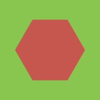
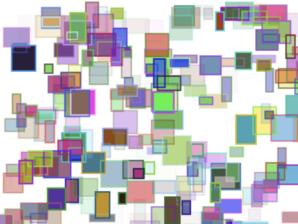
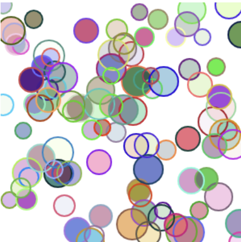
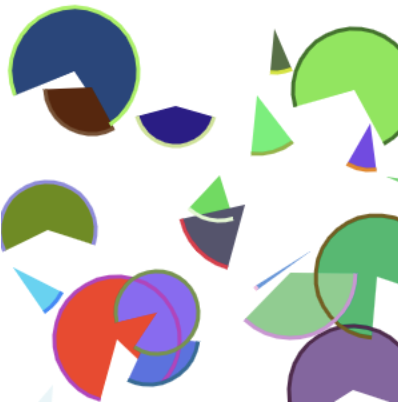
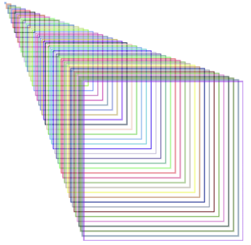
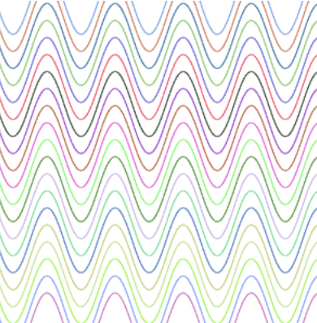
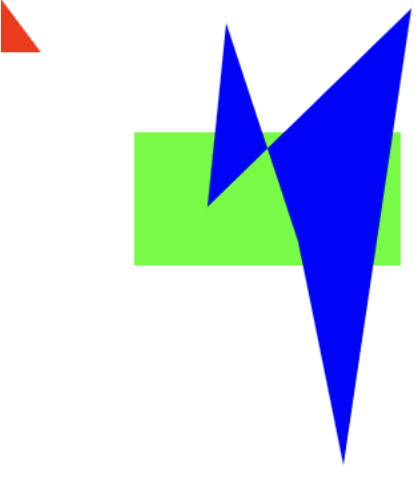
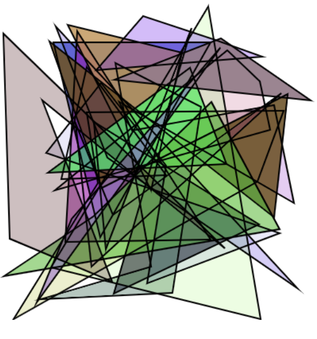

.. _drawing_shapes:

Drawing simple shapes
=====================

.. note::
    Note that because we are exposing the Web Canvas API, you can find more tutorials and documentation following this link: https://developer.mozilla.org/en-US/docs/Web/API/Canvas_API

    There are some API differences though:

    - The Canvas widget is directly exposing the `CanvasRenderingContext2D <https://developer.mozilla.org/en-US/docs/Web/API/CanvasRenderingContext2D>`_ API
    - All the API is written in *snake_case* instead of *camelCase*, so for example ``canvas.fillStyle = 'red'`` in JavaScript becomes ``canvas.fill_style = 'red'`` in Python

Before we can start drawing, we need to talk about the canvas grid. The origin of this grid is positioned in the
top left corner at coordinate (0,0). All elements are placed relative to this origin. So the position of the top
left corner of the blue square becomes x pixels from the left and y pixels from the top, at coordinate (x,y).

.. image:: images/grid.png

Drawing rectangles
------------------

There are six methods that draw rectangles on the canvas:

- ``fill_rect(x, y, width, height=None)``:
    Draws a filled rectangle. If ``height`` is None, it is set to the same value as ``width``.
- ``stroke_rect(x, y, width, height=None)``:
    Draws a rectangular outline. If ``height`` is None, it is set to the same value as ``width``.
- ``fill_rects(x, y, width, height=None)``:
    Draws filled rectangles. Where ``x``, ``y``, ``width`` and ``height`` are either integers, lists of integers or NumPy arrays.
    If ``height`` is None, it is set to the same value as ``width``.
- ``stroke_rects(x, y, width, height=None)``:
    Draws rectangular outlines. Where ``x``, ``y``, ``width`` and ``height`` are either integers, lists of integers or NumPy arrays.
    If ``height`` is None, it is set to the same value as ``width``.
- ``fill_styled_rects(x, y, width, height, color, alpha)``:
    Same as ``fill_rects``  but with additional ``(n x 3)`` ``color`` ndarray and ``(n)`` ``alpha`` ndarray.
- ``stroke_styled_rects(x, y, width, height, color, alpha)``:
    Same as ``stroke_rects`` but with additional ``(n x 3)`` ``color`` ndarray and ``(n)`` ``alpha`` ndarray.

You can also clear a certain canvas rectangle area:

- ``clear_rect(x, y, width, height=None)``:
    Clears the specified rectangular area, making it fully transparent. If ``height`` is None, it is set to the same value as ``width``.

.. code:: Python

    from ipycanvas import Canvas

    canvas = Canvas(width=200, height=200)

    canvas.fill_rect(25, 25, 100, 100)
    canvas.clear_rect(45, 45, 60, 60)
    canvas.stroke_rect(50, 50, 50, 50)

    canvas

.. image:: images/rect.png

``fill_rects`` and ``stroke_rects`` are blazingly fast ways of drawing up to a million rectangles at once:

.. code:: Python

    import numpy as np

    from ipycanvas import Canvas

    n_particles = 100_000

    x = np.array(np.random.rayleigh(250, n_particles), dtype=np.int32)
    y = np.array(np.random.rayleigh(250, n_particles), dtype=np.int32)
    size = np.random.randint(1, 3, n_particles)

    canvas = Canvas(width=800, height=500)

    canvas.fill_style = 'green'
    canvas.fill_rects(x, y, size)

    canvas

.. image:: images/rects.png

Drawing polygons
----------------

You can draw a polygon by providing a list of points, either a Python list, or a NumPy array.
It's the fastest way to draw a polygon with ipycanvas.

- ``fill_polygon(points)``:
    Fill a polygon from a list of points ``[(x1, y1), (x2, y2), ..., (xn, yn)]``.
- ``stroke_polygon(points)``:    Draw polygon outline from a list of points ``[(x1, y1), (x2, y2), ..., (xn, yn)]``.

- ``fill_polygons(points, points_per_polygon=None)``:
    Fill multiple polygons at once.
- ``stroke_polygons(points, points_per_polygon=None)``:
    Stroke multiple polygons at once. See :ref:`styled_polygons` for details.
- ``fill_styled_polygons(points, color, alpha, points_per_polygon=None)``:
    Fill multiple polygons at once where each polygon can have its own color.
    See :ref:`styled_polygons` for details.
- ``stroke_styled_polygons(points, color, alpha, points_per_polygon=None)``:
    Stroke multiple polygons at once where each polygon can have its own color.
    See :ref:`styled_polygons` for details.

.. code:: Python

    from ipycanvas import Canvas

    canvas = Canvas(width=200, height=200)

    canvas.fill_style = '#63934e'
    canvas.stroke_style = '#4e6393'
    canvas.line_width = 5
    canvas.fill_polygon([(20, 20), (180, 20), (100, 150)])
    canvas.stroke_polygon([(20, 20), (180, 20), (100, 150)])

    canvas

.. image:: images/polygon.png

.. code:: Python

    from math import pi
    import numpy as np
    from ipycanvas import Canvas

    def polygon(canvas, x, y, radius, n_points):
        angles = (2 * pi / n_points) * np.arange(n_points)

        v_x = x + np.cos(angles) * radius
        v_y = y + np.sin(angles) * radius

        points = np.stack((v_x, v_y), axis=1)

        canvas.fill_polygon(points)

    background_color = '#89c64f'
    polygon_color = '#c6574f'

    canvas = Canvas(width=200, height=200)

    canvas.fill_style = background_color
    canvas.fill_rect(0, 0, canvas.width, canvas.height)

    canvas.fill_style = polygon_color
    polygon(canvas, 100, 100, 70, 6)

    canvas

Drawing arcs and circles
------------------------

There are methods that draw arcs/circles on the canvas:

- ``fill_arc(x, y, radius, start_angle, end_angle, anticlockwise=False)``:
    Draw a filled arc centered at ``(x, y)`` with a radius of ``radius``.
- ``stroke_arc(x, y, radius, start_angle, end_angle, anticlockwise=False)``:
    Draw an arc outline centered at ``(x, y)`` with a radius of ``radius``.
- ``fill_arcs(x, y, radius, start_angle, end_angle, anticlockwise=False)``:
    Draw filled arcs centered at ``(x, y)`` with a radius of ``radius``. Where ``x``, ``y``, ``radius`` and other arguments are NumPy arrays, lists or scalar values.
- ``stroke_arcs(x, y, radius, start_angle, end_angle, anticlockwise=False)``:
    Draw an arc outlines centered at ``(x, y)`` with a radius of ``radius``. Where ``x``, ``y``, ``radius`` and other arguments are NumPy arrays, lists or scalar values.
- ``fill_styled_arcs( x, y, radius, start_angle, end_angle, color, alpha, anticlockwise=False)``:
    Same as ``fill_arcs`` but with additional ``(n x 3)`` ``color`` ndarray and ``(n)`` ``alpha`` ndarray.
- ``stroke_styled_arcs( x, y, radius, start_angle, end_angle, color, alpha, anticlockwise=False)``:
    Same as ``stroke_arcs`` but with additional ``(n x 3)`` ``color`` ndarray and ``(n)`` ``alpha`` ndarray.

- ``fill_circle(x, y, radius)``:
    Draw a filled circle centered at ``(x, y)`` with a radius of ``radius``.
- ``stroke_circle(x, y, radius)``:
    Draw an circle outline centered at ``(x, y)`` with a radius of ``radius``.
- ``fill_circles(x, y, radius)``:
    Draw filled circles centered at ``(x, y)`` with a radius of ``radius``. Where ``x``, ``y``, ``radius`` are NumPy arrays, lists or scalar values.
- ``stroke_circles(x, y, radius)``:
    Draw a circle outlines centered at ``(x, y)`` with a radius of ``radius``. Where ``x``, ``y``, ``radius`` are NumPy arrays, lists or scalar values.
- ``fill_styled_circles( x, y, radius color, alpha)`` :
    Same as ``fill_circles`` but with additional ``(n x 3)`` ``color`` ndarray and ``(n)`` ``alpha`` ndarray.
- ``stroke_styled_circles( x, y, radius, color, alpha)`` :
    Same as ``stroke_circles`` but with additional ``(n x 3)`` ``color`` ndarray and ``(n)`` ``alpha`` ndarray.

.. code:: Python

    from math import pi

    from ipycanvas import Canvas

    canvas = Canvas(width=200, height=200)

    canvas.fill_style = 'red'
    canvas.stroke_style = 'blue'

    canvas.fill_arc(60, 60, 50, 0, pi)
    canvas.stroke_circle(60, 60, 40)

    canvas

.. image:: images/arc.png

Drawing lines
-------------

There are two commands for drawing a straight line from one point to another:

- ``stroke_line(x1, y1, x2, y2)``:
    Draw a line from ``(x1, y1)`` to ``(x2, y2)``.
- ``stroke_lines(points)``:
    Draw a path of consecutive lines from a list of points ``[(x1, y1), (x2, y2), ..., (xn, yn)]``.
- ``stroke_styled_line_segments(points, points_per_line_segment=None)``:
    Draw multiple disconnected line-segments at once. See :ref:`styled_polygons` for details.
- ``stroke_styled_line_segments(points, color, alpha, points_per_line_segment=None)``:
    Draw multiple disconnected line-segments at once. See :ref:`styled_polygons` for details.

.. code:: Python

    from ipycanvas import Canvas

    canvas = Canvas(width=200, height=200)

    canvas.stroke_style = 'blue'
    canvas.stroke_line(0, 0, 150, 150)

    canvas.stroke_style = 'red'
    canvas.stroke_line(200, 0, 0, 200)

    canvas.stroke_style = 'green'
    canvas.stroke_line(150, 150, 0, 200)

    canvas

.. image:: images/lines.png

.. code:: Python

    import numpy as np

    from ipycanvas import Canvas

    canvas = Canvas(width=200, height=200)

    n = 50
    x = np.linspace(0, 200, n)
    y = np.random.randint(200, size=n)

    points = np.stack((x, y), axis=1)

    canvas.stroke_lines(points)

    canvas

.. image:: images/stroke_lines.png

Vectorized methods
------------------

Most methods like ``fill_rect``/``stroke_rect`` and ``fill_circle``/``stroke_circle`` have vectorized counterparts: ``fill_rects``/``stroke_rects`` and ``fill_circles``/``stroke_circles``. It is essential
to use those methods when you want to draw the same shape multiple times with the same style.

For example, it is way faster to run:

.. code:: Python

    from ipycanvas import Canvas

    canvas = Canvas(width=300, height=300)

    canvas.global_alpha = 0.01

    size = [i for i in range(300)]
    position = [300 - i for i in range(300)]

    canvas.fill_rects(position, position, size)

    canvas

instead of running:

.. code:: Python

    from ipycanvas import Canvas

    canvas = Canvas(width=300, height=300)

    canvas.global_alpha = 0.01

    for i in range(300):
        size = i
        position = 300 - i

        canvas.fill_rect(position, position, size)

    canvas

.. _styled_vectorized_methods:

Styled vectorized methods
------------------------------------

Ipycanvas provides methods to draw the same shape multiple times but with different colors:

- ``fill_styled_rects`` / ``stroke_styled_rects``
- ``fill_styled_circles`` / ``stroke_styled_circles``
- ``fill_styled_arcs`` / ``stroke_styled_arcs``
- ``fill_styled_polygons`` / ``stroke_styled_polygons``
- ``fill_styled_line_segments`` / ``stroke_styled_line_segments``

Rects
^^^^^^^^^^^^^^^^^^^^^^^^^^^^

.. code:: Python

    import numpy as np
    from ipycanvas import Canvas, hold_canvas

    canvas = Canvas(width=400, height=300)
    n_rects = 300
    x = np.random.randint(0, canvas.width, size=(n_rects))
    y = np.random.randint(0, canvas.width, size=(n_rects))
    width = np.random.randint(10, 40, size=(n_rects))
    height = np.random.randint(10, 40, size=(n_rects))
    colors_fill = np.random.randint(0, 255, size=(n_rects, 3))
    colors_outline = np.random.randint(0, 255, size=(n_rects, 3))
    alphas = np.random.random(n_rects)
    with hold_canvas():
        canvas.fill_styled_rects(x, y, width, height,
                                 color=colors_fill,
                                 alpha=alphas)
        canvas.line_width = 2
        canvas.stroke_styled_rects(x, y, width, height,
                                   color=colors_outline,
                                   alpha=alphas)
    canvas

Circles
^^^^^^^^^^^^^^^^^^^^^^^^^^^^

.. code:: Python

    import numpy as np
    from ipycanvas import Canvas, hold_canvas

    canvas = Canvas(width=300, height=300)
    n_circles = 100
    x = np.random.randint(0, canvas.width, size=(n_circles))
    y = np.random.randint(0, canvas.width, size=(n_circles))
    r = np.random.randint(10, 20, size=(n_circles))
    colors_fill = np.random.randint(0, 255, size=(n_circles, 3))
    colors_outline = np.random.randint(0, 255, size=(n_circles, 3))
    alphas = np.random.random(n_circles)
    with hold_canvas():
        canvas.fill_styled_circles(x, y, r, color=colors_fill, alpha=alphas)
        canvas.line_width = 2
        canvas.stroke_styled_circles(x, y, r, color=colors_outline)
    canvas

Arcs
^^^^^^^^^^^^^^^^^^^^^^^^^^^^

.. code:: Python

    import numpy as np
    from ipycanvas import Canvas, hold_canvas
    import math

    canvas = Canvas(width=300, height=300)
    n_circles = 100
    x = np.random.randint(0, canvas.width, size=(n_circles))
    y = np.random.randint(0, canvas.width, size=(n_circles))
    r = np.random.randint(10, 20, size=(n_circles))
    start_angle = np.random.randint(0, 360, size=(n_circles))
    end_angle = np.random.randint(0, 360, size=(n_circles))
    start_angle = 0
    end_angle = math.pi
    start_angle = np.random.random(n_circles) * math.pi
    end_angle = np.random.random(n_circles) * math.pi
    alphas = np.random.random(n_circles)
    with hold_canvas():
        canvas.fill_style = "cyan"
        canvas.fill_arcs(x, y, r, start_angle, end_angle)
        canvas.line_width = 1
        canvas.stroke_style = "black"
        canvas.stroke_arcs(x, y, r, start_angle, end_angle)
    canvas

.. _styled_polygons:

Polygons / line-segments
^^^^^^^^^^^^^^^^^^^^^^^^^^^^^^^^^^^^^^^^^^^^^^^^^^^^^^^^

Case 1: All polygons / line-segments have the same number of points
"""""""""""""""""""""""""""""""""""""""""""""""""""""""""""""""""""""""""

.. code:: Python

    import numpy as np
    from ipycanvas import Canvas, hold_canvas

    canvas = Canvas(width=300, height=300)
    n_polygons = 50

    # each polygon has 4 points
    n_points_per_polygon = 4

    polygons = np.zeros([n_polygons, n_points_per_polygon, 2])

    polygons[:, 0, 0] = 0.0
    polygons[:, 0, 1] = 0.0

    polygons[:, 1, 0] = 1.0
    polygons[:, 1, 1] = 0.0

    polygons[:, 2, 0] = 1.0
    polygons[:, 2, 1] = 1.0

    polygons[:, 3, 0] = 0.0
    polygons[:, 3, 1] = 1.0

    colors_fill = np.random.randint(0, 255, size=(n_polygons, 3))
    colors_outline = np.random.randint(0, 255, size=(n_polygons, 3))

    # scale each polygon
    polygons *= np.linspace(1.0, 200.0, num=n_polygons)[:, None, None]

    # translate each polygon
    polygons += np.linspace(1.0, 100.0, num=n_polygons)[:, None, None]

    points_per_polygon = np.ones([n_polygons]) * n_points_per_polygon
    with hold_canvas():
        canvas.stroke_styled_polygons(polygons, color=colors_fill)
    canvas

.. code:: Python

    import numpy as np
    from ipycanvas import Canvas, hold_canvas

    canvas = Canvas(width=300, height=300)

    n_line_segments = 20

    n_points_per_line_segment = 500

    line_segments = np.zeros([n_line_segments, n_points_per_line_segment, 2])

    x = np.linspace(0, canvas.width, num=n_points_per_line_segment)[None, :]
    line_segments[:, :, 0] = np.linspace(0, canvas.width,
                                         num=n_points_per_line_segment)[None, :]
    line_segments[:, :, 1] = (30.0 * np.sin(x * 0.1))[None, :]

    colors_outline = np.random.randint(0, 255, size=(n_polygons, 3))

    # translate line segments in y direction
    line_segments[:, :, 1] += np.linspace(1.0, canvas.height,
                                          num=n_line_segments)[:, None]

    with hold_canvas():
        canvas.stroke_styled_line_segments(line_segments, color=colors_fill)
    canvas

Case 2: Polygons / line-segments can have different number of Points.
"""""""""""""""""""""""""""""""""""""""""""""""""""""""""""""""""""""""""

Polygons can be given as a list of ndarrays:

.. code:: Python

    import numpy as np
    from ipycanvas import Canvas, hold_canvas

    canvas = Canvas(width=400, height=400)

    triangle = [(0, 0), (0, 40), (30, 40)]  # triangle
    rectangle = [(100, 100), (300, 100), (300, 200), (100, 200)]  # rectangle
    irregular = np.random.randint(0, 400, size=(5, 2))  # irregular with 5 sides
    polygons = [triangle, rectangle, irregular]
    colors = [(255, 0, 0), (0, 255, 0), (0, 0, 255)]

    with hold_canvas():
        canvas.fill_styled_polygons(polygons, color=colors)
    canvas

Polygons can be given as a flat ndarray:

.. code:: Python

    import numpy as np
    from ipycanvas import Canvas, hold_canvas

    canvas = Canvas(width=400, height=400)
    n_polygons = 20
    points_per_polygon = np.random.randint(3, 6, size=n_polygons)
    total_points = np.sum(points_per_polygon)
    polygons = np.random.randint(0, 400, size=[total_points, 2])
    alpha = np.random.random(n_polygons)
    colors_fill = np.random.randint(0, 255, size=(n_polygons, 3))
    colors_outline = np.random.randint(0, 255, size=(n_polygons, 3))

    with hold_canvas():
        # the filling
        canvas.fill_styled_polygons(
            polygons, points_per_polygon=points_per_polygon,
            color=colors_fill, alpha=alpha
        )

        # draw outlines ontop where each line has the same style
        canvas.stroke_style = "black"
        canvas.line_width = 2
        canvas.stroke_polygons(polygons, points_per_polygon=points_per_polygon)
    canvas

