Drawing shapes
==============

.. note::
    Note that because we are exposing the Web Canvas API, you can find more tutorials and documentation following this link: https://developer.mozilla.org/en-US/docs/Web/API/Canvas_API

    There are some API differences though:

    - The Canvas widget is directly exposing the `CanvasRenderingContext2D <https://developer.mozilla.org/en-US/docs/Web/API/CanvasRenderingContext2D>`_ API
    - All the API is written in *snake_case* instead of *camelCase*, so for example ``canvas.fillStyle = 'red'`` in JavaScript becomes ``canvas.fill_style = 'red'`` in Python

Before we can start drawing, we need to talk about the canvas grid. The origin of this grid is positioned in the
top left corner at coordinate (0,0). All elements are placed relative to this origin. So the position of the top
left corner of the blue square becomes x pixels from the left and y pixels from the top, at coordinate (x,y).

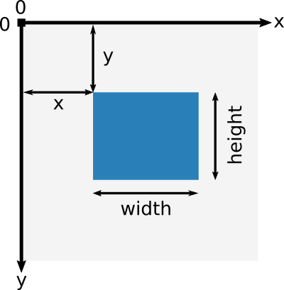

Drawing rectangles
------------------

There are four methods that draw rectangles on the canvas:

- ``fill_rect(x, y, width, height=None)``: Draws a filled rectangle. If ``height`` is None, it is set to the same value as ``width``.
- ``stroke_rect(x, y, width, height=None)``: Draws a rectangular outline. If ``height`` is None, it is set to the same value as ``width``.
- ``fill_rects(x, y, width, height=None)``: Draws filled rectangles. Where ``x``, ``y``, ``width`` and ``height`` are either integers, lists of integers or NumPy arrays. If ``height`` is None, it is set to the same value as ``width``.
- ``stroke_rects(x, y, width, height=None)``: Draws rectangular outlines. Where ``x``, ``y``, ``width`` and ``height`` are either integers, lists of integers or NumPy arrays. If ``height`` is None, it is set to the same value as ``width``.

You can also clear a certain canvas rectangle area:

- ``clear_rect(x, y, width, height=None)``: Clears the specified rectangular area, making it fully transparent. If ``height`` is None, it is set to the same value as ``width``.

.. code:: Python

    from ipycanvas import Canvas

    canvas = Canvas(width=200, height=200)

    canvas.fill_rect(25, 25, 100, 100)
    canvas.clear_rect(45, 45, 60, 60)
    canvas.stroke_rect(50, 50, 50, 50)

    canvas

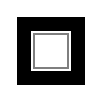

``fill_rects`` and ``stroke_rects`` are blazingly fast ways of drawing up to a million rectangles at once:

.. code:: Python

    import numpy as np

    from ipycanvas import Canvas

    n_particles = 100_000

    x = np.array(np.random.rayleigh(250, n_particles), dtype=np.int32)
    y = np.array(np.random.rayleigh(250, n_particles), dtype=np.int32)
    size = np.random.randint(1, 3, n_particles)

    canvas = Canvas(width=800, height=500)

    canvas.fill_style = 'green'
    canvas.fill_rects(x, y, size)

    canvas

.. image:: images/rects.png

Drawing circles
---------------

There are four methods that draw circles on the canvas:

- ``fill_arc(x, y, radius, start_angle, end_angle, anticlockwise=False)``: Draw a filled arc centered at ``(x, y)`` with a radius of ``radius``.
- ``stroke_arc(x, y, radius, start_angle, end_angle, anticlockwise=False)``: Draw an arc outline centered at ``(x, y)`` with a radius of ``radius``.
- ``fill_arcs(x, y, radius, start_angle, end_angle, anticlockwise=False)``: Draw filled arcs centered at ``(x, y)`` with a radius of ``radius``. Where ``x``, ``y``, ``radius`` and other arguments are NumPy arrays, lists or scalar values.
- ``stroke_arcs(x, y, radius, start_angle, end_angle, anticlockwise=False)``: Draw an arc outlines centered at ``(x, y)`` with a radius of ``radius``. Where ``x``, ``y``, ``radius`` and other arguments are NumPy arrays, lists or scalar values.

.. code:: Python

    from math import pi

    from ipycanvas import Canvas

    canvas = Canvas(width=200, height=200)

    canvas.fill_style = 'red'
    canvas.stroke_style = 'blue'

    canvas.fill_arc(60, 60, 50, 0, pi)
    canvas.stroke_arc(60, 60, 40, 0, 2 * pi)

    canvas

.. image:: images/arc.png

Drawing paths
-------------

A path is a list of points, connected by segments of lines that can be of different shapes, curved or not,
of different width and of different color. A path can be closed. To make shapes using paths, we take some
extra steps:

- First, you create the path with ``begin_path``
- Then you use drawing commands to draw into the path
- Once the path has been created, you can ``stroke`` or ``fill`` the path to render it

Here are the functions used to perform these steps:

- ``begin_path()``: Creates a new path. Once created, future drawing commands are directed into the path and used to build the path up.
- Draw commands like ``line_to`` and ``arc``
- ``close_path()``: Adds a straight line to the path, going to the start of the current path.
- ``stroke()``: Draws the shape by stroking its outline.
- ``fill(rule)``: Draws a solid shape by filling the path's content area. The given fill rule is applied, possible rules are `nonzero` and `evenodd`.

.. code:: Python

    from ipycanvas import Canvas

    canvas = Canvas(width=100, height=100)

    # Draw simple triangle shape
    canvas.begin_path()
    canvas.move_to(75, 50)
    canvas.line_to(100, 75)
    canvas.line_to(100, 25)
    canvas.fill()

    canvas

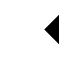

Draw commands
+++++++++++++

Here are the available draw commands:

- ``move_to(x, y)``: Moves the pen to the coordinates specified by x and y. This does not actually draw anything.
- ``line_to(x, y)``: Add a straight line to the current path by connecting the path’s last point to the specified (x, y) coordinates.
- ``arc(x, y, radius, start_angle, end_angle, anticlockwise=False)``: Create a circular arc centered at (x, y) with a radius
  of ``radius``. The path starts at ``start_angle`` and ends at ``end_angle`` in radians, and travels in the direction given by
  ``anticlockwise`` (defaulting to clockwise: False).
- ``arc_to(x1, y1, x2, y2, radius)``: Add a circular arc to the current path. Using the given control points (``x1``, ``y1``)
  and (``x2``, ``y2``) and the ``radius``.
- ``quadratic_curve_to(cp1x, cp1y, x, y)``: Add a quadratic Bezier curve to the current path.
  It requires two points: the first one is a control point and the second one is the end point. The starting point is the latest point in the current path, which can be changed using ``move_to()`` before creating the quadratic Bezier curve.
- ``bezier_curve_to(cp1x, cp1y, cp2x, cp2y, x, y)``: Add a cubic Bezier curve to the current path.
  It requires three points: the first two are control points and the third one is the end point. The starting point is the latest point in the current path, which can be changed using ``move_to()`` before creating the Bezier curve.
- ``rect(x, y, width, height)``: Draws a rectangle whose top-left corner is specified by (``x``, ``y``) with the specified ``width`` and ``height``.

Examples
++++++++

Stroke arcs
'''''''''''

.. code:: Python

    from math import pi

    from ipycanvas import Canvas

    canvas = Canvas(width=200, height=200)

    # Draw smiley face
    canvas.begin_path()
    canvas.arc(75, 75, 50, 0, pi * 2, True) # Outer circle
    canvas.move_to(110, 75)
    canvas.arc(75, 75, 35, 0, pi, False) # Mouth (clockwise)
    canvas.move_to(65, 65)
    canvas.arc(60, 65, 5, 0, pi * 2, True) # Left eye
    canvas.move_to(95, 65)
    canvas.arc(90, 65, 5, 0, pi * 2, True) # Right eye
    canvas.stroke()

    canvas

Fill bezier curves
''''''''''''''''''

.. code:: Python

    from ipycanvas import Canvas

    canvas = Canvas(width=200, height=200)

    # Cubic curves example
    canvas.begin_path()
    canvas.move_to(75, 40)
    canvas.bezier_curve_to(75, 37, 70, 25, 50, 25)
    canvas.bezier_curve_to(20, 25, 20, 62.5, 20, 62.5)
    canvas.bezier_curve_to(20, 80, 40, 102, 75, 120)
    canvas.bezier_curve_to(110, 102, 130, 80, 130, 62.5)
    canvas.bezier_curve_to(130, 62.5, 130, 25, 100, 25)
    canvas.bezier_curve_to(85, 25, 75, 37, 75, 40)
    canvas.fill()

    canvas

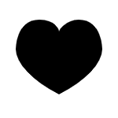

Change the fill rule
''''''''''''''''''''

.. code:: Python

    from math import pi
    from ipycanvas import Canvas

    canvas = Canvas(width=100, height=100)

    canvas.begin_path()
    canvas.arc(50, 50, 30, 0, pi * 2, True)
    canvas.arc(50, 50, 15, 0, pi * 2, True)
    canvas.fill('evenodd')

    canvas

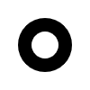

Styles and colors
-----------------

Colors
++++++

The ``Canvas`` has two color attributes, one for the strokes, and one for the surfaces.
You can also change the global transparency.

- ``stroke_style``: (valid HTML color) The color for rectangles and paths stroke. Default to 'black'.
- ``fill_style``: (valid HTML color) The color for filling rectangles and paths. Default to 'black'.
- ``global_alpha``: (float) Transparency level. Default to 1.0.

.. code:: Python

    from ipycanvas import Canvas

    canvas = Canvas(width=200, height=200)

    canvas.fill_style = 'red'
    canvas.stroke_style = 'blue'

    canvas.fill_rect(25, 25, 100, 100)
    canvas.clear_rect(45, 45, 60, 60)
    canvas.stroke_rect(50, 50, 50, 50)

    canvas

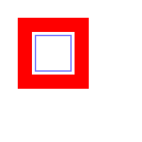

Shadows
+++++++

You can easily draw shadows by tweaking the following attributes:

- ``shadow_offset_x``: (float) Indicates the horizontal distance the shadow should extend from the object. This value isn't affected by the transformation matrix. The default is ``0``.
- ``shadow_offset_y``: (float) Indicates the vertical distance the shadow should extend from the object. This value isn't affected by the transformation matrix. The default is ``0``.
- ``shadow_blur``: (float) Indicates the size of the blurring effect; this value doesn't correspond to a number of pixels and is not affected by the current transformation matrix. The default value is ``0``.
- ``shadow_color``: (valid HTML color) A standard CSS color value indicating the color of the shadow effect; by default, it is fully-transparent black: ``'rgba(0, 0, 0, 0)'``.

.. code:: Python

    from ipycanvas import Canvas

    canvas = Canvas(width=200, height=200)

    canvas.shadow_color = 'green'
    canvas.shadow_offset_x = 2
    canvas.shadow_offset_y = 3
    canvas.shadow_blur = 3

    canvas.fill_rect(25, 25, 100, 100)
    canvas.clear_rect(45, 45, 60, 60)

    canvas.shadow_color = 'blue'
    canvas.stroke_rect(50, 50, 50, 50)

    canvas

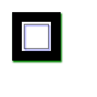

Lines styles
++++++++++++

You can change the following ``Canvas`` attributes in order to change the lines styling:

- ``line_width``: (float) Sets the width of lines drawn in the future, must be a positive number. Default to 1.0.
- ``line_cap``: (str) Sets the appearance of the ends of lines, possible values are 'butt', 'round' and 'square'. Default to 'butt'.
- ``line_join``: (str) Sets the appearance of the “corners” where lines meet, possible values are 'round', 'bevel' and 'miter'. Default to 'miter'
- ``miter_limit``: (float) Establishes a limit on the miter when two lines join at a sharp angle, to let you control how thick the junction becomes. Default to 10..
- ``get_line_dash()``: Return the current line dash pattern array containing an even number of non-negative numbers.
- ``set_line_dash(segments)``: Set the current line dash pattern.
- ``line_dash_offset``: (float) Specifies where to start a dash array on a line. Default is 0..

Line width
''''''''''

Sets the width of lines drawn in the future.

.. code:: Python

    from ipycanvas import Canvas

    canvas = Canvas(width=400, height=280)
    canvas.scale(2)

    for i in range(10):
        width = 1 + i
        x = 5 + i * 20
        canvas.line_width = width

        canvas.fill_text(str(width), x - 5, 15)

        canvas.begin_path()
        canvas.move_to(x, 20)
        canvas.line_to(x, 140)
        canvas.stroke()
    canvas

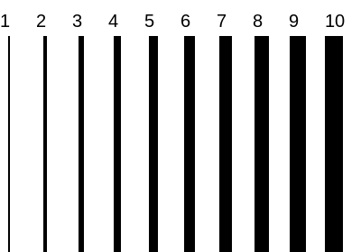

Line cap
''''''''

Sets the appearance of the ends of lines.

.. code:: Python

    from ipycanvas import Canvas

    canvas = Canvas(width=320, height=360)

    # Possible line_cap values
    line_caps = ['butt', 'round', 'square']

    canvas.scale(2)

    # Draw guides
    canvas.stroke_style = '#09f'
    canvas.begin_path()
    canvas.move_to(10, 30)
    canvas.line_to(140, 30)
    canvas.move_to(10, 140)
    canvas.line_to(140, 140)
    canvas.stroke()

    # Draw lines
    canvas.stroke_style = 'black'
    canvas.font = '15px serif'

    for i in range(len(line_caps)):
        line_cap = line_caps[i]
        x = 25 + i * 50

        canvas.fill_text(line_cap, x - 15, 15)
        canvas.line_width = 15
        canvas.line_cap = line_cap
        canvas.begin_path()
        canvas.move_to(x, 30)
        canvas.line_to(x, 140)
        canvas.stroke()

    canvas

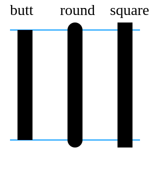

Line join
'''''''''

Sets the appearance of the "corners" where lines meet.

.. code:: Python

    from ipycanvas import Canvas

    canvas = Canvas(width=320, height=360)

    # Possible line_join values
    line_joins = ['round', 'bevel', 'miter']

    min_y = 40
    max_y = 80
    spacing = 45

    canvas.line_width = 10
    canvas.scale(2)
    for i in range(len(line_joins)):
        line_join = line_joins[i]

        y1 = min_y + i * spacing
        y2 = max_y + i * spacing

        canvas.line_join = line_join

        canvas.fill_text(line_join, 60, y1 - 10)

        canvas.begin_path()
        canvas.move_to(-5, y1)
        canvas.line_to(35, y2)
        canvas.line_to(75, y1)
        canvas.line_to(115, y2)
        canvas.line_to(155, y1)
        canvas.stroke()

    canvas

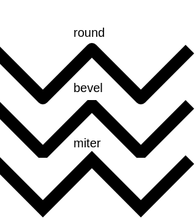

Line dash
'''''''''

Sets the current line dash pattern.

.. code:: Python

    from ipycanvas import Canvas

    canvas = Canvas(width=400, height=280)
    canvas.scale(2)

    line_dashes = [
        [5, 10],
        [10, 5],
        [5, 10, 20],
        [10, 20],
        [20, 10],
        [20, 20]
    ]

    canvas.line_width = 2

    for i in range(len(line_dashes)):
        x = 5 + i * 20

        canvas.set_line_dash(line_dashes[i])
        canvas.begin_path()
        canvas.move_to(x, 0)
        canvas.line_to(x, 140)
        canvas.stroke()
    canvas

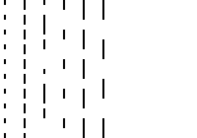
