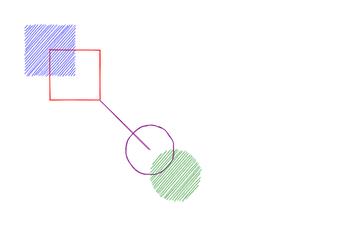

.. _rough_canvas:

Rough Canvas
============

ipycanvas provides a special canvas class that automatically gives a hand-drawn style to your drawings.
The ``RoughCanvas`` API is the same as the ``Canvas`` one, except that it provides a few more options.

Create a RoughCanvas
--------------------

You create a ``RoughCanvas`` the same way you would create a normal ``Canvas``.

.. code:: Python

    from ipycanvas import RoughCanvas

    canvas = RoughCanvas(width=200, height=200)
    canvas

Then your drawings will have an hand-drawn style:

.. code:: Python

    from ipycanvas import RoughCanvas

    canvas = RoughCanvas()

    canvas.stroke_style = 'red'
    canvas.fill_style = 'blue'
    canvas.stroke_rect(100, 100, 100, 100)
    canvas.fill_rect(50, 50, 100, 100)

    canvas.stroke_style = 'purple'
    canvas.fill_style = 'green'
    canvas.stroke_circle(300, 300, 100)
    canvas.fill_circle(350, 350, 100)

    canvas.stroke_line(200, 200, 300, 300)

    canvas

.. note::
    The ``RoughCanvas`` does not support yet applying the hand-drawn style to custom path commands (``begin_path``, ``arc_to``, etc)

Fill style
----------

The ``RoughCanvas`` provides a second fill style option ``rough_fill_style`` which changes the way shapes are filled.

.. code:: Python

    from ipycanvas import RoughCanvas

    canvas = RoughCanvas(width=850, height=100)

    canvas.fill_style = 'blue'
    canvas.line_width = 2.

    rough_fill_style_values = ['hachure', 'solid', 'zigzag', 'cross-hatch', 'dots', 'sunburst', 'dashed', 'zigzag-line']

    for i in range(len(rough_fill_style_values)):
        canvas.rough_fill_style = rough_fill_style_values[i]

        canvas.fill_rect(10 + i * 100, 10, 90, 80)

    canvas

.. image:: images/roughfillstyle.png

Roughness
---------

You can change the roughness of your drawing changing the ``roughness`` attribute (float).
A rectangle with the roughness of 0 would be a perfect rectangle. There is no upper limit to this value, but a value over 10 is mostly useless.

.. code:: Python

    from ipycanvas import RoughCanvas

    canvas = RoughCanvas(width=850, height=100)

    canvas.fill_style = 'green'

    for i in range(8):
        canvas.roughness = i

        canvas.fill_rect(10 + i * 100, 10, 90, 80)

    canvas

.. image:: images/roughness.png

Bowing
------

You can change the curves of your drawing changing the ``bowing`` attribute (float).
It's a numerical value indicating how curvy the lines are when drawing a sketch. A value of 0 will cause straight lines.

.. code:: Python

    from ipycanvas import RoughCanvas

    canvas = RoughCanvas(width=850, height=150)

    canvas.fill_style = 'green'

    for i in range(8):
        canvas.bowing = i * 3.

        canvas.stroke_rect(20 + i * 100, 20, 90, 110)

    canvas

.. image:: images/bowing.png
