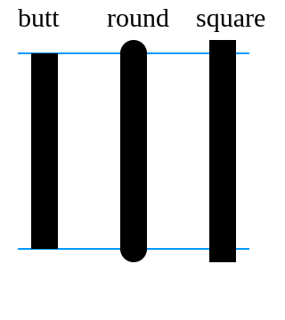
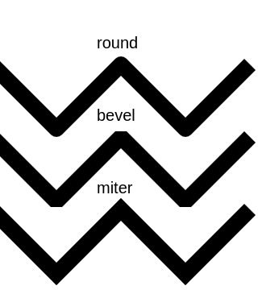
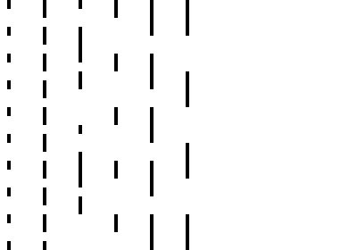

Styles and colors
=================

Colors
------

The ``Canvas`` has two color attributes, one for the strokes, and one for the surfaces.
You can also change the global transparency.

- ``stroke_style``: (valid HTML color)
    The color for rectangles and paths stroke. Default to 'black'.
- ``fill_style``: (valid HTML color)
    The color for filling rectangles and paths. Default to 'black'.
- ``global_alpha``: (float)
    Transparency level. Default to 1.0.

.. code:: Python

    from ipycanvas import Canvas

    canvas = Canvas(width=200, height=200)

    canvas.fill_style = 'red'
    canvas.stroke_style = 'blue'

    canvas.fill_rect(25, 25, 100, 100)
    canvas.clear_rect(45, 45, 60, 60)
    canvas.stroke_rect(50, 50, 50, 50)

    canvas

.. image:: images/colored_rect.png

Color Gradients
---------------

There are two canvas methods that allow you to create color gradients (either linear or radial) that you can use as a ``fill_style`` or ``stroke_style``.

- ``create_linear_gradient(x0, y0, x1, y1, color_stops)``:
    Create a ``LinearGradient`` object given the start point ``(x0, y0)``, end point ``(x1, y1)``, and color stops.
- ``create_radial_gradient(x0, y0, r0, x1, y1, r1, color_stops)``:
    Create a ``RadialGradient`` object given the start circle ``(x0, y0, r0)``, end circle ``(x1, y1, r1)``, and color stops.

You need to provide the start point and end point of your gradient (those coordinates are global to the entire canvas, it's not per-shape).
The color stops is a list of tuple ``(offset, color)``, ``offset`` being a number between 0 and 1, inclusive, representing the position of the
color stop. 0 represents the start of the gradient and 1 represents the end.

.. code:: Python

    from ipycanvas import Canvas

    canvas = Canvas(width=700, height=50)

    gradient = canvas.create_linear_gradient(
        0, 0, # Start position (x0, y0)
        700, 0, # End position (x1, y1)
        # List of color stops
        [
            (0, 'red'),
            (1 / 6, 'orange'),
            (2 / 6, 'yellow'),
            (3 / 6, 'green'),
            (4 / 6, 'blue'),
            (5 / 6, '#4B0082'),
            (1, 'violet')
        ]
    )

    canvas.fill_style = gradient
    canvas.fill_rect(0, 0, 700, 50)

    canvas

.. image:: images/linear_gradient.png

.. code:: Python

    from ipycanvas import Canvas

    canvas = Canvas(width=570, height=200)

    radial_gradient = canvas.create_radial_gradient(
        238, 50, 10, # Start circle (x0, y0, r0)
        238, 50, 300, # End circle (x1, y1, r1)
        [
            (0, '#8ED6FF'),
            (1, '#004CB3'),
        ]
    )

    canvas.fill_style = radial_gradient

    canvas.fill_rect(0, 0, 570, 200)

    canvas

.. image:: images/radial_gradient.png

Patterns
--------

ipycanvas provides a mean to easily create patterns. You can create a pattern from an ``ipywidgets.Image`` widget, from a ``Canvas`` or a ``MultiCanvas``,
the created pattern can then be used as a ``fill_style`` or ``stroke_style``.

- ``create_pattern(image, repetition='repeat')``:
    Create a ``Pattern`` object given the image source (either an ``ipywidgets.Image``, a ``Canvas`` or a ``MultiCanvas``),
    and the ``repetition`` which is a string indicating how to repeat the pattern's image, can be "repeat" (both directions),
    "repeat-x" (horizontal only), "repeat-y" (vertical only), "no-repeat" (neither direction).

First create your pattern source or load it from an Image file with ``ipywidgets.Image``:

.. code:: Python

    from math import pi

    from ipycanvas import Canvas

    pattern_source = Canvas(width=50, height=50)

    pattern_source.fill_style = '#fec'
    pattern_source.fill_rect(0, 0, 50, 50)
    pattern_source.stroke_arc(0, 0, 50, 0, .5 * pi)

    pattern_source

.. image:: images/pattern_source.png

Then use it as a ``fill_style`` or ``stroke_style``:

.. code:: Python

    canvas = Canvas(width=200, height=200)

    pattern = canvas.create_pattern(pattern_source)

    canvas.fill_style = pattern
    canvas.fill_rect(0, 0, canvas.width, canvas.height)

    canvas

.. image:: images/pattern.png

RoughCanvas
-----------

ipycanvas provides a special ``Canvas`` class which will automatically give a hand-drawn style to your drawings: see the :ref:`rough_canvas` section.

Shadows
-------

You can easily draw shadows by tweaking the following attributes:

- ``shadow_offset_x``: (float)
    Indicates the horizontal distance the shadow should extend from the object. This value isn't affected by the transformation matrix. The default is ``0``.
- ``shadow_offset_y``: (float)
    Indicates the vertical distance the shadow should extend from the object. This value isn't affected by the transformation matrix. The default is ``0``.
- ``shadow_blur``: (float)
    Indicates the size of the blurring effect; this value doesn't correspond to a number of pixels and is not affected by the current transformation matrix.
    The default value is ``0``.
- ``shadow_color``: (valid HTML color)
    A standard CSS color value indicating the color of the shadow effect; by default, it is fully-transparent black: ``'rgba(0, 0, 0, 0)'``.

.. code:: Python

    from ipycanvas import Canvas

    canvas = Canvas(width=200, height=200)

    canvas.shadow_color = 'green'
    canvas.shadow_offset_x = 2
    canvas.shadow_offset_y = 3
    canvas.shadow_blur = 3

    canvas.fill_rect(25, 25, 100, 100)
    canvas.clear_rect(45, 45, 60, 60)

    canvas.shadow_color = 'blue'
    canvas.stroke_rect(50, 50, 50, 50)

    canvas

.. image:: images/shadows.png

Lines styles
------------

You can change the following ``Canvas`` attributes in order to change the lines styling:

- ``line_width``: (float)
    Sets the width of lines drawn in the future, must be a positive number. Default to 1.0.
- ``line_cap``: (str)
    Sets the appearance of the ends of lines, possible values are 'butt', 'round' and 'square'. Default to 'butt'.
- ``line_join``: (str)
    Sets the appearance of the “corners” where lines meet, possible values are 'round', 'bevel' and 'miter'. Default to 'miter'
- ``miter_limit``: (float)
    Establishes a limit on the miter when two lines join at a sharp angle, to let you control how thick the junction becomes. Default to 10..
- ``get_line_dash()``:
    Return the current line dash pattern array containing an even number of non-negative numbers.
- ``set_line_dash(segments)``:
    Set the current line dash pattern.
- ``line_dash_offset``: (float)
    Specifies where to start a dash array on a line. Default is 0..

Line width
++++++++++

Sets the width of lines drawn in the future.

.. code:: Python

    from ipycanvas import Canvas

    canvas = Canvas(width=400, height=280)
    canvas.scale(2)

    for i in range(10):
        width = 1 + i
        x = 5 + i * 20
        canvas.line_width = width

        canvas.fill_text(str(width), x - 5, 15)

        canvas.begin_path()
        canvas.move_to(x, 20)
        canvas.line_to(x, 140)
        canvas.stroke()
    canvas

.. image:: images/line_width.png

Line cap
++++++++

Sets the appearance of the ends of lines.

.. code:: Python

    from ipycanvas import Canvas

    canvas = Canvas(width=320, height=360)

    # Possible line_cap values
    line_caps = ['butt', 'round', 'square']

    canvas.scale(2)

    # Draw guides
    canvas.stroke_style = '#09f'
    canvas.begin_path()
    canvas.move_to(10, 30)
    canvas.line_to(140, 30)
    canvas.move_to(10, 140)
    canvas.line_to(140, 140)
    canvas.stroke()

    # Draw lines
    canvas.stroke_style = 'black'
    canvas.font = '15px serif'

    for i in range(len(line_caps)):
        line_cap = line_caps[i]
        x = 25 + i * 50

        canvas.fill_text(line_cap, x - 15, 15)
        canvas.line_width = 15
        canvas.line_cap = line_cap
        canvas.begin_path()
        canvas.move_to(x, 30)
        canvas.line_to(x, 140)
        canvas.stroke()

    canvas

Line join
+++++++++

Sets the appearance of the "corners" where lines meet.

.. code:: Python

    from ipycanvas import Canvas

    canvas = Canvas(width=320, height=360)

    # Possible line_join values
    line_joins = ['round', 'bevel', 'miter']

    min_y = 40
    max_y = 80
    spacing = 45

    canvas.line_width = 10
    canvas.scale(2)
    for i in range(len(line_joins)):
        line_join = line_joins[i]

        y1 = min_y + i * spacing
        y2 = max_y + i * spacing

        canvas.line_join = line_join

        canvas.fill_text(line_join, 60, y1 - 10)

        canvas.begin_path()
        canvas.move_to(-5, y1)
        canvas.line_to(35, y2)
        canvas.line_to(75, y1)
        canvas.line_to(115, y2)
        canvas.line_to(155, y1)
        canvas.stroke()

    canvas

Line dash
+++++++++

Sets the current line dash pattern.

.. code:: Python

    from ipycanvas import Canvas

    canvas = Canvas(width=400, height=280)
    canvas.scale(2)

    line_dashes = [
        [5, 10],
        [10, 5],
        [5, 10, 20],
        [10, 20],
        [20, 10],
        [20, 20]
    ]

    canvas.line_width = 2

    for i in range(len(line_dashes)):
        x = 5 + i * 20

        canvas.set_line_dash(line_dashes[i])
        canvas.begin_path()
        canvas.move_to(x, 0)
        canvas.line_to(x, 140)
        canvas.stroke()
    canvas

