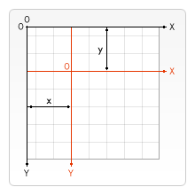
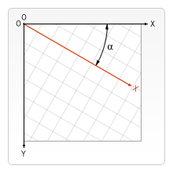

Transformations
===============

- ``translate(x, y)``: Moves the canvas and its origin on the grid. ``x`` indicates the horizontal distance to move, and ``y`` indicates how far to move the grid vertically.

- ``rotate(angle)``: Rotates the canvas clockwise around the current origin by the ``angle`` number of radians.

- ``scale(x, y=None)``: Scales the canvas units by ``x`` horizontally and by ``y`` vertically. If ``y`` is None, it is set to the same value as ``x``. Both parameters are real numbers. Values that are smaller than 1.0 reduce the unit size and values above 1.0 increase the unit size. Values of 1.0 leave the units the same size.
